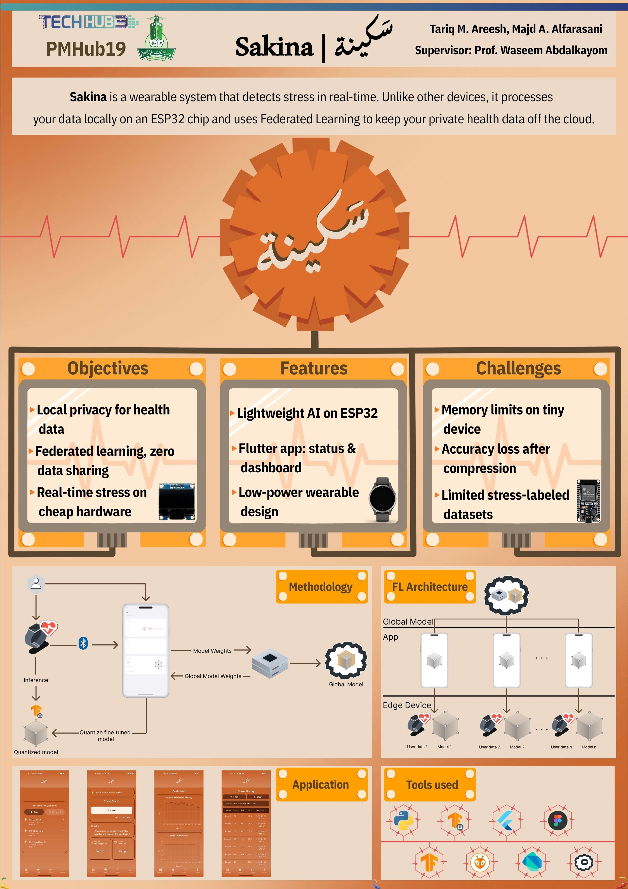

Sakina is a real-time stress monitoring system built around privacy. Instead of sending
your data to the cloud, it runs an AI model directly on an ESP32 and uses Federated
Learning to improve the model over time, only sharing weight updates, never raw data.

Built with Flutter, TensorFlow Lite, and Flower FL.

CPCS499 | Group C02 | King Abdulaziz University

  

